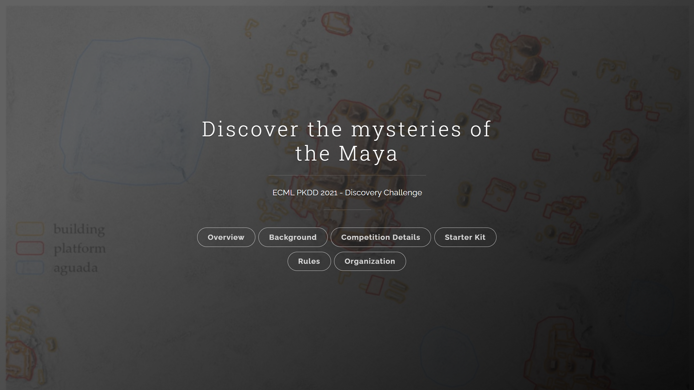
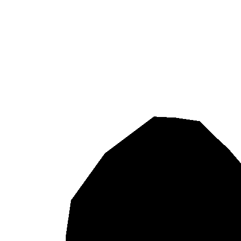
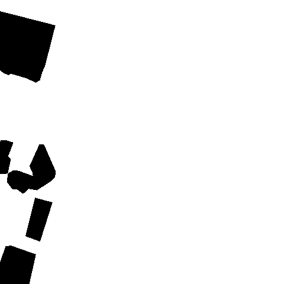
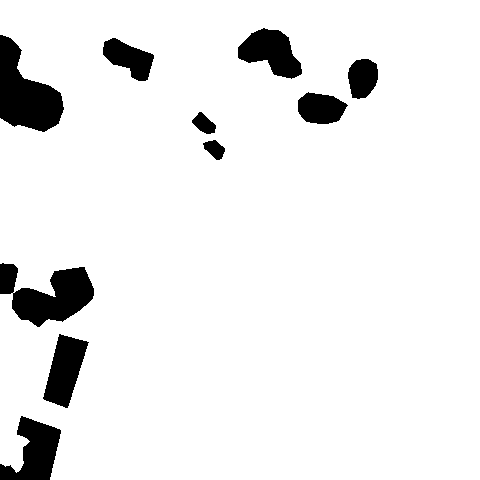

# MayaChallenge

## Competition overview
Task is semantic segmentation of Maya building on satellite images.
The dataset consists of tiles derived from of Sentinel-1, Sentinel-2, and ALS (lidar) data, and associated annotation
masks. Each tile measures 240 x 240 meters and has spatial resolution of 10 meters for Sentinel data and 0.5 meters for
ALS data. The Sentinel-1 and Sentinel-2 data for each tile is stored separately in multi-band TIFF files (see data
structure).

| aguadas | platforms | buildings |
| :-----: | :-------: | :-------: |
|  |  |  |

## Methods

I was trying to use different models and different approaches to solve this task.

models:

- Unet
- Linknet
- FPN
- PSPNet
- DeepLabV3 (best)

losses:

- BCE
- Dice
- Focal
- IoU (best)

optimizers:

- AdamW
- SGD
- Adam (best)

## Results

I have reached these metrics and 9th place in the competition.

| Avg. IOU (overall) | Avg. IOU of aguadas | Avg. IOU of platforms| Avg. IOU of buildings |
|---|---|---|---|
| 0.7905 | 0.9718 | 0.6983 | 0.7013 |
